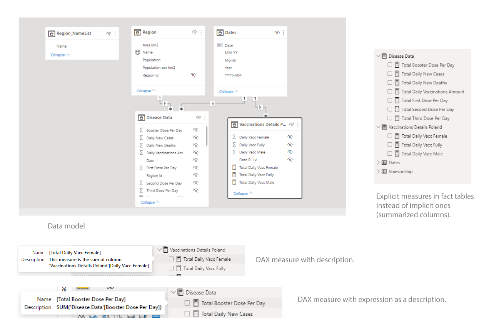

### Description
In my first project using Power Bi, I wanted to show the COVID-19 pandemic situation in 16 Polish regions. I focused on 3 parameters: **cases**, **deaths** and **vaccinations**. At first my main motivation for using covid data was to create ridgeline plot using DENEB custom visual where I could show a comparison between all regions in a very clear way – unfortunately it is very hard to do in Vega Lite, so I decided to concentrate on report creation with simpler, out of the box visuals. Apart from that I wanted to follow best practices of data modelling.



### Data sources
1.	COVID-19 dataset maintained by Michał Rogalski –  [COVID-19 w Polsce - Arkusze Google](https://docs.google.com/spreadsheets/d/1ierEhD6gcq51HAm433knjnVwey4ZE5DCnu1bW7PRG3E/edit)
2.	Vaccinations dataset maintained by Michał Rogalski and Andrzej Wisłocki - [COVID-19 w Polsce - Szczepienia - Arkusze Google](https://docs.google.com/spreadsheets/d/19DqluO7mmKrheqBDRD2ZFM2ZLSi4YTW2nwLbPHkiTYU/edit#gid=0)
3.	Regions population and surface area - [Główny Urząd Statystyczny / Obszary tematyczne / Ludność / Ludność / Powierzchnia i ludność w przekroju terytorialnym w 2021 roku](https://stat.gov.pl/obszary-tematyczne/ludnosc/ludnosc/powierzchnia-i-ludnosc-w-przekroju-terytorialnym-w-2021-roku,7,18.html)

Connection with first two sources was established using Power Query’s Google Sheets connector. Third source was downloaded and accessed via Power Query through ‘from csv’ option. For all three sources I used **import** mode.

### Data model

My goal was to create a simple star-schema model so that writing DAX measures would be easier. I ended up with 5 tables:
1.	Disease Data (**fact**) – main fact table only with keys and region-level numbers
2.	Vaccinations Details Poland (**fact**) – second fact table with specific country-level data for vaccinations (which cannot be calculated form main fact table)
3.	Dates (**dimension**) – calendar table created in Power Query
4.	Region (**dimension**) – dimension table with regions data
5.	Region_NameList (**dimension**) – disconnected table used only for measures based on slicer selection.

As sources are not updated on regular basis (last update on 10th of March 2022) I decided to not include a ‘last refresh date stamp’ in the report and not schedule a refresh in Power Bi service.

### What have I learned
#### 1.	Power Query
-	Data cleaning with several transformations using GUI: transpose, pivot, unpivot, replace values etc.
-	Building calendar table with parameters (hardcoded dates – next time I want them dynamic)
-	Reversing running totals using index columns (most of data for cases, deaths and vaccinations had to be recalculated from running totals)
-	Adding surrogate keys in PQ through merging tables to replace strings in fact table and thus optimize data model
#### 2.	Data modelling:
-	Using DAX Studio to analyze model metrics and check if there are some major problems with column size, cardinality etc.
-	Using scripts in Tabular Editor 2.0 to hide unnecessary columns, format DAX, add measures (totals) to numeric columns and also measure descriptions (some with standard descriptions and some with DAX measure as a description). I wanted to create folders also but finally decided to leave it as it is. I ended up with ‘clean’ fact tables where only explicit measures are visible.
-	Separating data model from report – I made a thin report from published dataset using live connection. Unfortunately I needed to remade the whole report because of that as live-connected reports cannot be published to the web. Again with Tabular Editor’s help it was not a very tiresome task.
#### 3.	Report building
-	Using navigation pane, buttons, bookmarks, drill through.
-	Editing visuals’ colors with conditional formatting to enhance clarity.
-	Writing dynamic measures that were dependent on slicer selection (here the disconnected table proved useful).
-	Trying some more advanced DAX measures with variables.
-	For most visuals I decided to turn header icons off to reduce the noise.

### Summary
Working on this project was enjoyable for me and I learned a lot! I only scraped the surface when it comes to Tabular Editor but already see a great potential in this tool – need to know all its capabilities. Same with DAX Studio.

Working on thin reports is not that easy as I thought – data model must be carefully designed as some changes are not possible after uploading to PB Service. I think it is great option when there are multiple report creators. 

I used mostly basic visuals and would really like to dive deeper into more advanced data visualization techniques (especially learn DENEB).

